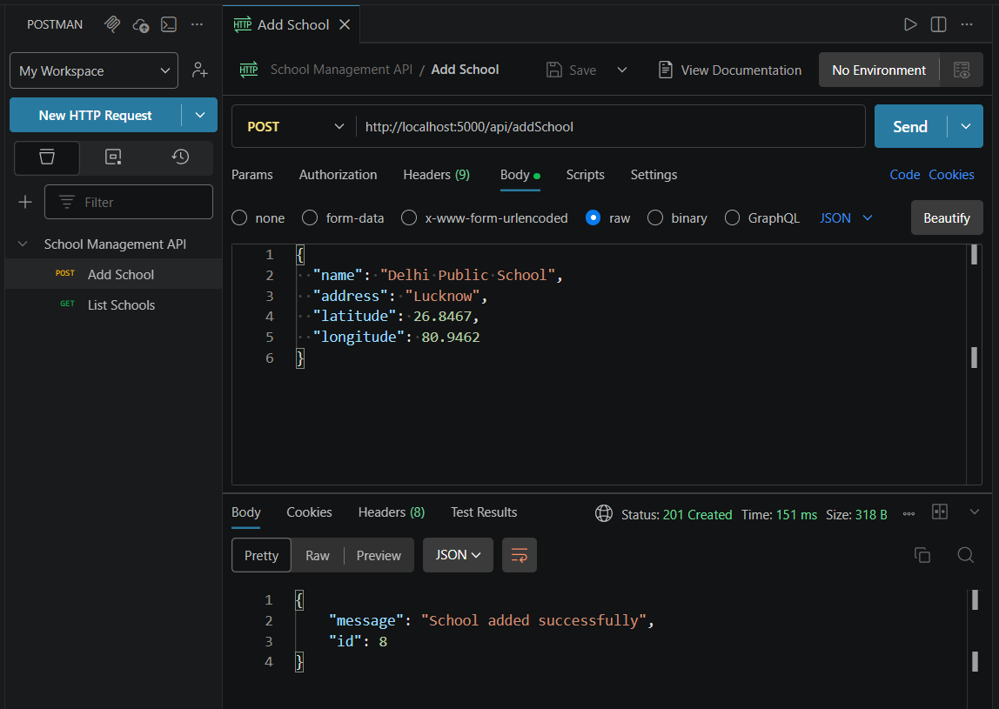
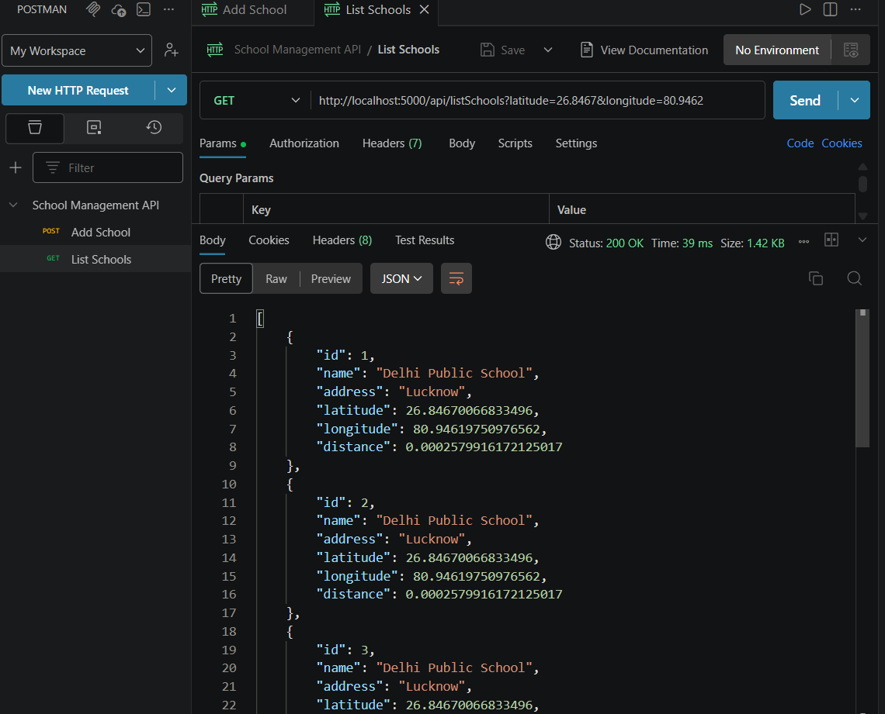

#  School Management API

A backend application built using **Node.js, Express.js, and MySQL** that allows users to add schools and retrieve them sorted by proximity to a given location.

---

##  Features

*  Add new schools with location data
*  Retrieve schools sorted by nearest distance
*  Distance calculation using Haversine formula
*  RESTful API design
*  Clean modular architecture (controllers, routes, utils)

---

##  Tech Stack

* **Backend:** Node.js, Express.js
* **Database:** MySQL
* **Library:** mysql2
* **API Testing:** Postman

---

##  Project Structure

```
project-root/
│
├── config/
│   └── db.js
├── controllers/
│   └── schoolController.js
├── routes/
│   └── schoolRoutes.js
├── utils/
│   └── distance.js
├── .env
├── server.js
└── README.md
```

---

##  Setup Instructions

### 1️ Clone the repository

```bash
git clone https://github.com/your-username/school-management-api.git
cd school-management-api
```

---

### 2️ Install dependencies

```bash
npm install
```

---

### 3️ Setup environment variables

Create a `.env` file:

```
PORT=5000
DB_HOST=localhost
DB_USER=root
DB_PASSWORD=your_password
DB_NAME=school_db
```

---

### 4️ Setup MySQL Database

Run the following SQL:

```sql
CREATE DATABASE school_db;

USE school_db;

CREATE TABLE schools (
    id INT AUTO_INCREMENT PRIMARY KEY,
    name VARCHAR(255) NOT NULL,
    address VARCHAR(255) NOT NULL,
    latitude FLOAT NOT NULL,
    longitude FLOAT NOT NULL
);
```

---

###  Run the server

```bash
npm run dev
```

Server will run on:

```
http://localhost:5000
```

---

##  API Endpoints

---

### ➕ Add School

* **Endpoint:** `/api/addSchool`
* **Method:** `POST`

#### Request Body:

```json
{
  "name": "Delhi Public School",
  "address": "Lucknow",
  "latitude": 26.8467,
  "longitude": 80.9462
}
```

#### Response:

```json
{
  "message": "School added successfully",
  "id": 1
}
```

---

### 📍 List Schools

* **Endpoint:** `/api/listSchools`
* **Method:** `GET`

#### Example:

```
/api/listSchools?latitude=26.8467&longitude=80.9462
```

#### Response:

```json
[
  {
    "id": 1,
    "name": "Delhi Public School",
    "distance": 0.00
  }
]
```

---

## 🧠 How Distance is Calculated

The API uses the **Haversine formula** to calculate the distance between two geographic coordinates (latitude & longitude), ensuring accurate proximity-based sorting.

---

## 📸 Screenshots (Recommended)

### ➕ Add School API



### 📍 List Schools API



---

##  Postman Collection

Import the provided Postman collection file to test APIs easily.

---

##  Future Improvements

* Pagination support
* SQL-based distance optimization
* Authentication (JWT)
* Frontend integration

---

##  Author

Akshita Syal

---
